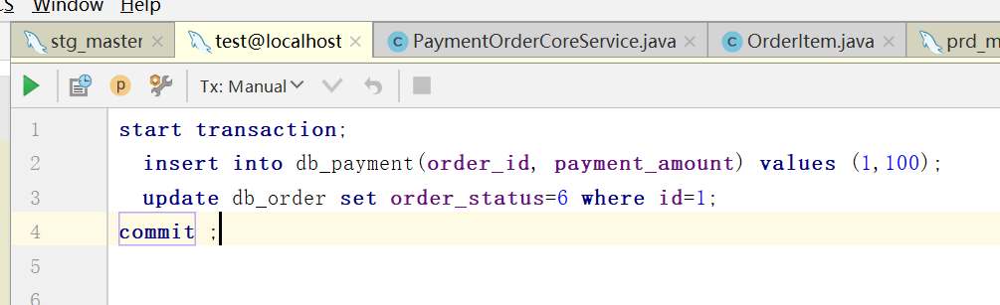
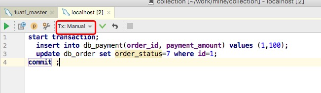

最近项目中突然发现一次锁现象，订单多次付款，最后一次退款。退款完成后支付系统手动第三方回调，支付系统多次通知订单系统，订单系统在这个过程中发生死锁，下面给出订单系统表结构做模拟死锁。

# 情景
* 数据库结构(5.7.13)
````
create database test_deadlock default character set utf8 collate utf8_general_ci;

use test_deadlock;

create table db_order(
  id bigint(1) not null auto_increment comment '主键',
  order_no varchar(64) not null comment '订单号',
  order_status tinyint(4) not null default '1' comment '订单状态',
  create_date timestamp not null default current_timestamp comment '开单时间',
  primary key (id)
)engine=innodb default charset =utf8;

create table db_payment(
  id bigint not null auto_increment comment '主键',
  order_id bigint(1) not null comment '订单主表id',
  payment_amount decimal(19,2) not null default '0' comment '支付金额',
  primary key (id)
)engine=innodb default charset =utf8;;

alter table db_payment add constraint   fk_order_id foreign key(order_id) references db_order(id);
````

* 初始化数据
````
insert into db_order(order_no,order_status) values ('10001',5);
insert into db_payment(order_id, payment_amount) values (1,100);
````

* 第一个事务
````
start transaction;
  insert into db_payment(order_id, payment_amount) values (1,100);
  update db_order set order_status=6 where id=1;
commit ;
````

* 第二个事务
````
start transaction;
  insert into db_payment(order_id, payment_amount) values (1,200);
  update db_order set order_status=7 where id=1;
commit ;
````

# 模拟
 为了方便模拟，这个使用idea连接数据库分别打开两个console，并且开启Manual模式。

 * 事务A
  
  

 * 事务B
  
  

  这里我们使用TA(1)表示执行第一个事务的第一行代码。首先我们执行TA(1)和TA(2)，然后执行TB(1),TB(2)，然后在执行TA(3),再执行TB(3),此时得到结构如下。

````
[40001][1213] Deadlock found when trying to get lock; try restarting transaction
````

 可以看出InnoDB检测到死锁。

 接下来我们删除外键，执行操作

````
 alter table db_payment drop foreign key fk_order_id;
````

 然后再次执行上面的操作，操作过程分别问TA(1)，TA(2)，TB(1)，TB(2)，TA(3)，TB(3)，TA(4),TB(4),最后两个事务都完成执行。

  可以看出一个有外键和一个没有外键的区别。

# 分析原因
* 核心知识点
 

# 参考
* [Mysql中那些锁机制之InnoDB](https://blog.csdn.net/zhanghongzheng3213/article/details/51721903)
* [MySQL自增长与锁的进一步认识](https://blog.csdn.net/poxiaonie/article/details/72899975)