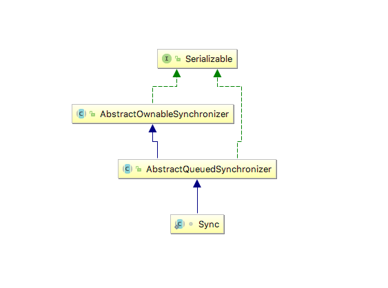
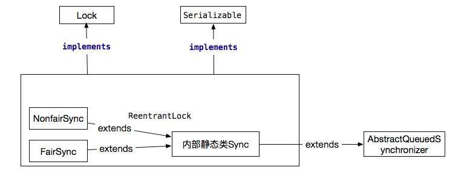
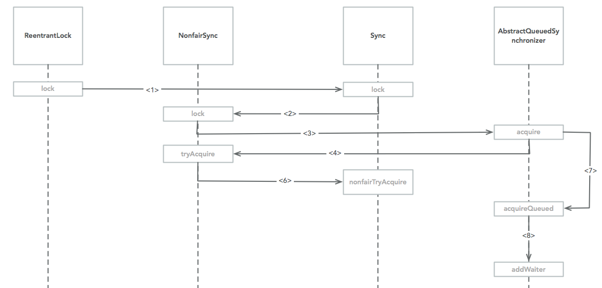

ReentrantLock源码分析
=============

# 概述
 在JAVA中通常实现锁有两种方式，一种是synchronized关键字，另一种是Lock接口。synchronized是基于jvm层面实现的，Lock是基于jdk底层实现，接下来主要来分析ReentrantLock源码，理解ReentrantLock实现原理。 

 为了理解锁的重要性和存在的意义，首先应该在思考以下几个问题。 

 1. 程序中为什么要使用锁？
 2. 常见实现锁的方法，你知道的有哪些？
 3. Lock与synchronized的区别在哪里？
 4. Lock锁定的主体是谁，谁是Lock拥有者？

# ReentrantLock源码
 ReentrantLock类在java.util.concurrent.locks包中，它的上一级的包java.util.concurrent主要是常用的并发控制类，它是基于AQS（AbstractQueuedSynchronizer）实现的，这里先不说那么多原理，那么，我们就从AbstractQueuedSynchronizer的其中一个实现类ReentrantLock说起，理解AQS的实现原理，先来看看他们直接的关系。

图1
图2

 ReentrantLock类的API调用都委托给一个静态内部类Sync，该类继承了AbstractQueuedSynchronizer类；而Sync分表有两个子类FairSync和NonfairSync，这也是我们常说的公平锁与非公平锁，他们两者有什么区分呢？我们先从非公平锁NonfairSync开始分析，最后再总结他们之间的异同。

````
Lock lock = new ReentrantLock();

        try {
            lock.lock();

        }finally {
            lock.unlock();
        }
````

 以上代码是对Lock最常见的使用方法，先上锁然后再释放锁，如果忘记释放锁就会产生死锁问题，通常在finally代码块中释放锁，ReentrantLock有两个构造器，无参构造器默认创建了的是非公平锁，接下来我们先以非公平锁模拟多个线程竞争锁，来具体分析源码。 

````
 public ReentrantLock() {
        sync = new NonfairSync();
    }

    public ReentrantLock(boolean fair) {
        sync = fair ? new FairSync() : new NonfairSync();
    }
````

#### 模拟线程竞争非公平锁分析源码
 首先假设有以下代码片段（着里抽象描述代码结构，不按这里执行）。

````
public static void main(String[] args) {
        ReentrantLock reentrantLock = new ReentrantLock();

        try {
            reentrantLock.lock();
            //do something
        } finally {
            reentrantLock.unlock();
        }

        Thread t1 = new Thread(() -> {
            try {
                reentrantLock.lock();
                //do something
            } finally {
                reentrantLock.unlock();
            }
        });
        t1.setName("线程2");
        t1.start();


        Thread t2 = new Thread(() -> {
            try {
                reentrantLock.lock();
                //do something
            } finally {
                reentrantLock.unlock();
            }
        });
        t2.setName("线程3");
        t2.start();
        
        System.out.println("测试完成");
    }
````

 ReentrantLock被实例化后（实例对象称为rLock,方便下文描述），第一个线程调用lock方法获取锁，该方法首先使用CAS去更新AQS中state的值，如果更新成功那么当前线程抢占锁成功，显然ReentrantLock实例化后默认值就是0，抢占成功，既当前锁被线程1独占。

````
static final class NonfairSync extends Sync {
        private static final long serialVersionUID = 7316153563782823691L;

        final void lock() {
            if (compareAndSetState(0, 1))
                setExclusiveOwnerThread(Thread.currentThread());
            else
                acquire(1);
        }

        protected final boolean tryAcquire(int acquires) {
            return nonfairTryAcquire(acquires);
        }
    }
````

 * compareAndSetState做了什么？
 > compareAndSetState方法是贯穿于整个ReentrantLock实现原理的重中之重，理解这个方法必须先要理解CAS的原理，这里简单的说一下CAS原理。比较和替换是设计并发算法时用到的一种技术。简单来说，比较和替换是使用一个期望值和一个变量的当前值进行比较，如果当前变量的值与我们期望的值相等，就使用一个新值替换当前变量的值。在JAVA中CAS的操作被封装到了Unsafe这个类中，看源码的时候常常看到以compareAndSwap打头的方法，看到这样的方法，不必要大惊小怪，原理都一样，都是CAS操作。并且这些方法都是native方法，利用JNI来完成CPU指令的操作,JAVA的CAS最终利用了CPU的原子操作来保证了JAVA原子操作。
 
 * setExclusiveOwnerThread做了什么？ 
> setExclusiveOwnerThread只是一个简单的set操作，他更新了rLock中的exclusiveOwnerThread属性，exclusiveOwnerThread是AQS类中的一个实例变量（"private transient Thread exclusiveOwnerThread;"）用来引用当前锁的持有者。

 此时假设thread1还没有执行完到unlock，即还未释放锁，另一个线程thread2进入，那么thread2首先会进行抢占式的去获取锁调用compareAndSetState，此时thread1还未释放锁，compareAndSetState方法返回false，thread2抢占锁失败。接下来调用acquire方法，此方法在AbstractQueuedSynchronizer中，源码如下。

 ````
 public final void acquire(int arg) {
        if (!tryAcquire(arg) &&
            acquireQueued(addWaiter(Node.EXCLUSIVE), arg))
            selfInterrupt();
    }
 ````

 着里的方法调用比较复杂，首先我们给一张图，说明这些方法都在哪些类中。

 

 先来看ReentrantLock中的nonfairTryAcquire方法，源码如下：

````
final boolean nonfairTryAcquire(int acquires) {
            final Thread current = Thread.currentThread();
            //获取AQS的state属性，getState方法在AQS类中，直接返回了state变量的值。
            int c = getState();
            //=0表示没有线程持有锁，
            if (c == 0) {
                if (compareAndSetState(0, acquires)) {
                    setExclusiveOwnerThread(current);
                    //竞争锁成功
                    return true;
                }
            }
            //当前持有锁的线程就是本身，那么重入，这里也是重入锁的核心，之前我对这一行代码非常疑惑，看了知乎的一个话题后霍然开朗，主要是没有理解重入锁和自旋锁的概念。
            //这里实现了偏向锁
            else if (current == getExclusiveOwnerThread()) {
                int nextc = c + acquires;
                //限制了重入锁的次数是小于Integer.MAX_VALUE,这是为什么呢?我们知道int的最大值是2147483647，当加一后二进制符号为1，此刻为-2147483648。
                if (nextc < 0) // overflow
                    throw new Error("Maximum lock count exceeded");
                setState(nextc);
                //竞争锁成功
                return true;
            }
            //未竞争到锁
            return false;
        }
````

* state
> state是AQS中的一个实例变量（private volatile int state;），他主要负责记录是否有线程持有锁，以及同一个线程重入的次数。当state=0的时候表示没有线程持有锁，state>0表示已有线程持有锁，他的值就表示重入的次数。当然了state是基于CAS原子操作的，compareAndSetState方法就是用来修改state的值。
* 理解自旋锁和重入锁
> [java的可重入锁用在哪些场合？](https://www.zhihu.com/question/23284564)


#### 添加Node到队列尾部
````
private Node addWaiter(Node mode) {
        Node node = new Node(Thread.currentThread(), mode);
        // Try the fast path of enq; backup to full enq on failure
        Node pred = tail;
        if (pred != null) {
            node.prev = pred;
            if (compareAndSetTail(pred, node)) {
                pred.next = node;
                return node;
            }
        }
        enq(node);
        return node;
    }
````
````
private Node enq(final Node node) {
        //自旋位置
        for (;;) {
            Node t = tail;
            if (t == null) { // Must initialize
                if (compareAndSetHead(new Node()))
                    tail = head;
            } else {
                node.prev = t;
                if (compareAndSetTail(t, node)) {
                    t.next = node;
                    return t;
                }
            }
        }
    }
````
    在多个线程进入的情况下，最终还是CAS保证了原子性。
#### acquireQueued
````
final boolean acquireQueued(final Node node, int arg) {
        boolean failed = true;
        try {
            boolean interrupted = false;
            for (;;) {
                final Node p = node.predecessor();
                if (p == head && tryAcquire(arg)) {
                    //保证了header永远是一个空的Node（thread）
                    setHead(node);
                    p.next = null; // help GC
                    failed = false;
                    return interrupted;
                }
                //parkAndCheckInterrupt方法阻塞线程
                if (shouldParkAfterFailedAcquire(p, node) &&
                    parkAndCheckInterrupt())
                    interrupted = true;
            }
        } finally {
            if (failed)
                cancelAcquire(node);
        }
    }
````


# Lock和synchromnized实现原理对比


# 问题探讨
#### 程序中为什么要使用锁？
 我们写的程序部署在操作系统中，应用程序运行操作的都是资源，应用程序对资源有读写的权限，简单的说为了保证多个应用或者多个线程对同一个数据处理，保持数据的原子性使用的一种策略。

#### 常见实现锁的方法，你知道的有哪些？

#### Lock与synchronized的区别在哪里？


# 分析思路
* 按照多个线程走代码的方式去调试，然后反推，多思考。


# 参考
* [ReentrantLock解析](http://blog.csdn.net/yanlinwang/article/details/40450769)
* [AbstractQueuedSynchronizer源码剖析（六）- 深刻解析与模拟线程竞争资源](http://blog.csdn.net/pfnie/article/details/53191892)
* [ReentrantLock实现原理深入探究](http://www.cnblogs.com/xrq730/p/4979021.html)
* [AbstractQueuedSynchronizer的介绍和原理分析](http://ifeve.com/introduce-abstractqueuedsynchronizer/)
* [Java并发机制及锁的实现原理](http://blog.csdn.net/sunxianghuang/article/details/51932179)
* [Java锁--Lock实现原理(底层实现)](http://blog.csdn.net/Luxia_24/article/details/52403033)
* [synchronized的JVM底层实现（很详细 很底层）](http://blog.csdn.net/niuwei22007/article/details/51433669)

